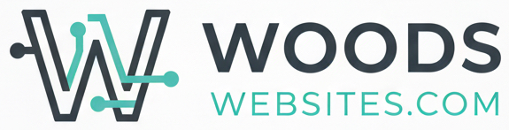

# Woods Websites

Professional web design and development portfolio site built with Next.js 15 and Tailwind CSS v4.



## 🚀 Live Site

Coming soon: [woodswebsites.com](https://woodswebsites.com)

## 📋 Project Overview

Woods Websites is a portfolio and business site showcasing web design and development services. The site features:

- Portfolio case study cards with project showcases
- Comprehensive service offerings
- Client testimonials and case studies
- Contact form for lead generation
- Fully responsive design
- Optimized for performance and SEO

## 🛠️ Tech Stack

- **Framework**: Next.js 15 (App Router)
- **Styling**: Tailwind CSS v4
- **Language**: TypeScript
- **Fonts**: DM Sans (body), Fraunces (headlines)
- **Deployment**: Cloudflare Pages (planned)

## 📁 Project Structure

```
woods-websites/
├── app/
│   ├── components/
│   │   ├── Navigation.tsx           # Header with mobile menu
│   │   ├── Footer.tsx               # Site footer
│   │   └── CaseStudyCard.tsx        # Portfolio project card
│   ├── portfolio/
│   │   └── page.tsx                 # Portfolio showcase page
│   ├── services/
│   │   └── page.tsx                 # Services page
│   ├── about/
│   │   └── page.tsx                 # About us page
│   ├── contact/
│   │   └── page.tsx                 # Contact form
│   ├── layout.tsx                   # Root layout
│   ├── page.tsx                     # Homepage
│   └── globals.css                  # Global styles
├── public/
│   └── images/                      # Portfolio images
└── SETUP-INSTRUCTIONS.md            # Setup guide
```

## 🎨 Design System

### Colors

- **Navy** (#102a43 - #f0f4f8): Primary brand color for text and sections
- **Orange** (#7c2d12 - #fff7ed): Accent color for CTAs and highlights
- **Slate** (#0f172a - #f8fafc): Neutral grays for body text

### Typography

- **Unbounded**: Bold geometric sans-serif for headlines and UI elements (distinctive, modern)
- **Libre Baskerville**: Elegant serif for body text (readable, classic)

## 🏃 Getting Started

### Prerequisites

- Node.js 20+ installed
- npm or yarn package manager

### Installation

1. Clone the repository:
```bash
git clone https://github.com/mwoods-1/woods-websites.git
cd woods-websites
```

2. Install dependencies:
```bash
npm install
```

3. Add portfolio images to `/public/images/`:
   - aviation-card.jpg
   - svens-card.jpg
   - ovens-card.jpg
   - kingdom-card.jpg
   - woods-websites-logo.jpg

4. Run the development server:
```bash
npm run dev
```

5. Open [http://localhost:3000](http://localhost:3000) in your browser

## 📦 Available Scripts

- `npm run dev` - Start development server
- `npm run build` - Build for production
- `npm start` - Start production server
- `npm run lint` - Run ESLint

## 🚢 Deployment

### Cloudflare Pages

1. Push your code to GitHub
2. Connect your repo to Cloudflare Pages
3. Build settings:
   - **Build command**: `npm run build`
   - **Build output directory**: `.next`
   - **Framework preset**: Next.js

Cloudflare will automatically deploy on every push to main!

### Alternative: Vercel

1. Push to GitHub
2. Import project in Vercel
3. Deploy automatically

## 📝 Portfolio Projects Featured

1. **Aviation Expeditions** - Complete redesign of Alaskan flightseeing tour website
2. **Sven's Basecamp Hostel** - Modern redesign with Cloudbeds integration
3. **Ovens Soccer** - Brand new sports organization website

## 🎯 Key Features

- **Case Study Cards**: Visual portfolio project showcases
- **Responsive Design**: Mobile-first approach
- **Performance Optimized**: Fast load times and smooth animations
- **SEO Friendly**: Proper meta tags and semantic HTML
- **Contact Form**: Lead generation with validation
- **Modern Stack**: Next.js 15 with latest features

## 🤝 Contributing

This is a private project for Woods Websites. For collaboration:

1. Create a branch for your feature
2. Make your changes
3. Test thoroughly
4. Submit a pull request

## 📄 License

© 2026 Woods Websites. All rights reserved.

## 🔗 Links

- Portfolio: [/portfolio](http://localhost:3000/portfolio)
- Services: [/services](http://localhost:3000/services)
- About: [/about](http://localhost:3000/about)
- Contact: [/contact](http://localhost:3000/contact)

## 📧 Contact

For inquiries: hello@woodswebsites.com

---

Built with ❤️ by Woods Websites
